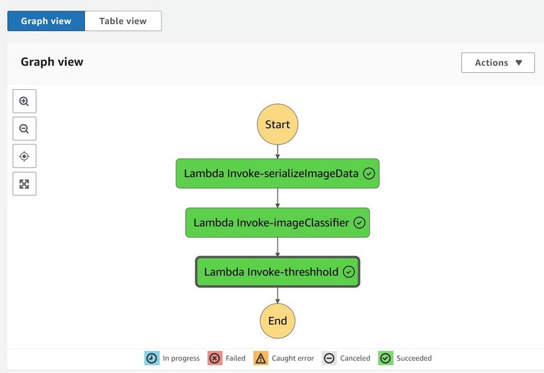
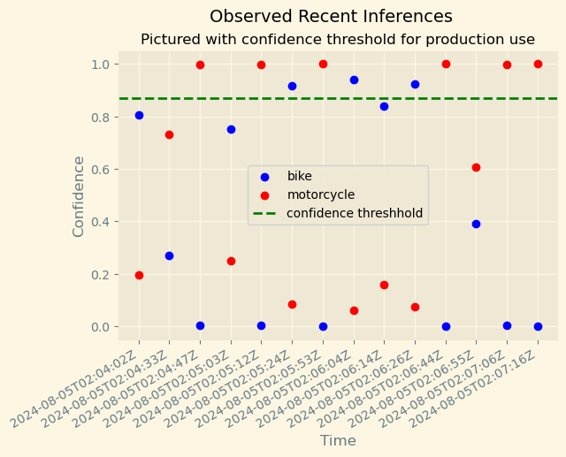

# AWS-SageMaker-ML-Image-Classification-Workflow

In this workflow AWS SageMaker, Lambda, Step Functions and Model Monitor are used to create an event-driven ML workflow that can be incorporated into a company's production architecture. The SageMaker Estimator API deploys the SageMaker Model Endpoint. AWS Lambda and Step Functions orchestrate the ML workflow. Using SageMaker Model Monitor the Endpoint is instrumented and observed. Inference Data from Model Monitor is used to create a visualization to help stakeholders understand the performance of the Endpoint over time.

### Techniques Used

- Amazon Web Services (AWS)
- AWS SageMaker image classification
- AWS Lambda functions
- AWS Model Monitor
- AWS Step Functions orchestration
- AWS S3 storage
- Data Preparation

-------------------
#### AWS Step Functions

#### Inference Confidence Plot

